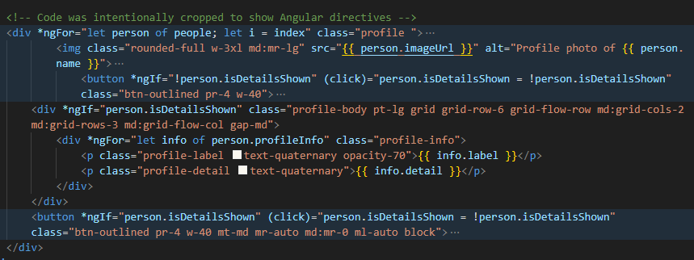

# UNITE 
UNITE is a web development company website we created to demonstrate our proficiency in using the Angular framework, especially on the Angular Directives and Routing. UI/UX design principles were also applied using Tailwind CSS to deliver an aesthetically pleasing and responsive user interface. This project was done as a prelim project requirement for the Advanced Dynamic Web Applications (AWEB) course.

The website consists of five pages: the Home (Landing) Page, About Page, Services Page, Contacts Page, and a custom 404 Error Page for an enhanced user experience. 

You may access the website here: https://unitewebdev.netlify.app/

## Home Page Preview

## Angular Directives
The "Meet the Team" section on the About Page is dynamically rendered using `*ngFor` directive to iterate through profile data and the `*ngIf` directive to conditionally display content.

**Preview:**

## Angular Routing
Routes are implemented for each of the website's pages for navigation, including a custom 404 page for invalid routes.

## Contributors 
| Roles | Names |Links |
|-|-|-|
| Front-End Dev, UI/UX Designer, Documentation | Bryan Aaron Santiago | [@bancantcode](https://github.com/Bancantcode) |
| Front-End Dev, UI/UX Designer, Deployment | Jimwel Valdez | [@jimvdz](https://github.com/jimvdz) |
| Front-End Dev, UI/UX Designer, Documentation | Luis Miguel Cayanan | [@lmcay](https://github.com/lmcay) |

Copyright &copy; 2025 by Santiago, Valdez, and Cayanan. All rights reserved.